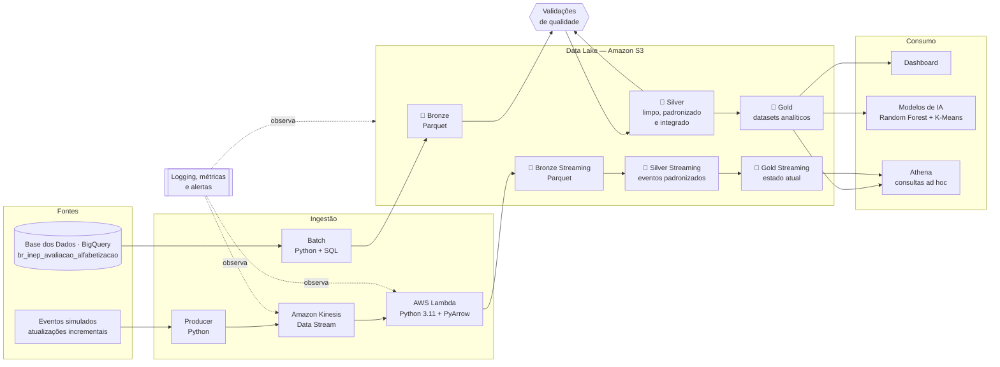

<!-- Proposta de README atualizado — incorpora Streaming (seção 11) e Machine Learning (seção 17, nova) ao conteúdo já existente em README.md. Não substitui o README.md automaticamente; é o candidato a subir na PR. -->

# Indicador Criança Alfabetizada — Pipeline Híbrida de Dados

**Tech Challenge · Fase 2 — FIAP AI Scientist**

Pipeline de dados híbrida (batch + streaming) em nuvem, construída sobre Arquitetura Medalhão (Bronze → Silver → Gold), para integrar, tratar e disponibilizar os dados do **Indicador Criança Alfabetizada** — a métrica oficial que acompanha o percentual de estudantes alfabetizados ao final do 2º ano do Ensino Fundamental.


> **Legenda de status:** ✅ concluído · 🚧 em andamento · ⏳ planejado
> **Documentação:** este README é o documento único do projeto — problema, arquitetura, decisões, execução e evidências.

---

## Sumário

1. [O problema](#1-o-problema)
2. [A solução em uma página](#2-a-solução-em-uma-página)
3. [Fonte de dados](#3-fonte-de-dados)
4. [Arquitetura](#4-arquitetura)
5. [Infraestrutura como código](#5-infraestrutura-como-código)
6. [Decisões arquiteturais e trade-offs](#6-decisões-arquiteturais-e-trade-offs)
7. [As camadas do data lake](#7-as-camadas-do-data-lake)
8. [Contrato da camada Silver](#8-contrato-da-camada-silver)
9. [Qualidade de dados](#9-qualidade-de-dados)
10. [Orquestração](#10-orquestração)
11. [Ingestão em streaming](#11-ingestão-em-streaming)
12. [Observabilidade e monitoramento](#12-observabilidade-e-monitoramento)
13. [Análise exploratória](#13-análise-exploratória)
14. [Anomalia identificada no Rio Grande do Sul](#14-anomalia-identificada-no-rio-grande-do-sul)
15. [FinOps — custo e otimização](#15-finops--custo-e-otimização)
16. [Aplicação em IA e políticas públicas](#16-aplicação-em-ia-e-políticas-públicas)
17. [Modelagem de Machine Learning](#17-modelagem-de-machine-learning)
18. [Como executar](#18-como-executar)
19. [Evidências de execução](#19-evidências-de-execução)
20. [Estrutura do repositório](#20-estrutura-do-repositório)
21. [Fluxo de trabalho Git](#21-fluxo-de-trabalho-git)
22. [Roadmap e status](#22-roadmap-e-status)
23. [Equipe](#23-equipe)
24. [Licença](#24-licença)

---

## 1. O problema

O Brasil assumiu o compromisso de alfabetizar **todas as crianças até o final do 2º ano do Ensino Fundamental até 2030**. Para medir o avanço, o INEP aplica uma avaliação padronizada e considera alfabetizado o estudante que atinge **743 pontos na escala Saeb de Língua Portuguesa**.

O desafio de dados não está em coletar a informação — ela é pública. Está em **integrá-la e mantê-la confiável ao longo do tempo**. Os resultados por aluno, as metas por ente federativo e as dimensões territoriais são tabelas distintas, com granularidades distintas, produzidas em momentos distintos. Cruzá-las exige normalizar códigos territoriais, conciliar representações diferentes da mesma rede de ensino e decidir o que fazer quando duas fontes discordam sobre o mesmo número.

Sem uma camada integrada, cada análise vira retrabalho manual: alguém consulta a base, monta um cruzamento em planilha, chega a um número — e ninguém consegue reproduzir aquele número três meses depois. **Gestores educacionais não conseguem responder perguntas simples de forma confiável e recorrente:** quais municípios estão abaixo da meta, onde o avanço estagnou, quais redes melhoraram e quanto.

Esta pipeline resolve esse gargalo. Transforma dados públicos brutos em uma camada analítica versionada, validada e reprodutível, pronta para consumo por dashboards, análises estatísticas e modelos de IA.

---

## 2. A solução em uma página

| Dimensão | O que entregamos |
|---|---|
| **Ingestão** | Extração programática das tabelas públicas via BigQuery (batch) + produtor de eventos simulando atualizações do indicador via Amazon Kinesis e AWS Lambda (streaming) |
| **Armazenamento** | Data lake em Amazon S3 em Arquitetura Medalhão, com dados em Parquet particionado |
| **Tratamento** | Padronização de esquemas, normalização de chaves territoriais, tipagem correta e integração das entidades |
| **Qualidade** | Validações automatizadas com relatório versionado a cada execução — registro reprovado vai para quarentena, não é descartado em silêncio |
| **Camada Gold** | Quatro datasets: série do indicador, evolução temporal, trajetória até 2030 e features para modelagem |
| **Modelagem preditiva** | Classificação de risco por Random Forest (AUC-ROC 0,748) e clusterização de vulnerabilidade por K-Means (k=4), aplicadas sobre a camada Gold |
| **Operação** | Logging estruturado, métricas de execução e alertas de falha |
| **FinOps** | Arquitetura serverless, formato colunar particionado e estimativa de custo mensal documentada |

**O diferencial da entrega é a reprodutibilidade.** Qualquer avaliador clona o repositório, configura as credenciais e reconstrói a pipeline inteira do zero com um comando. Nenhuma etapa depende de download manual, planilha local ou arquivo que alguém precisa mandar por e-mail.

---

## 3. Fonte de dados

Todas as entidades vêm de uma única fonte: o dataset público **`basedosdados.br_inep_avaliacao_alfabetizacao`**, hospedado no BigQuery pela plataforma [Base dos Dados](https://basedosdados.org/).

O INEP é o **produtor** do dado; a Base dos Dados é o **meio de acesso** — ela publica os microdados oficiais já tratados, tipados e consultáveis via SQL. A extração acontece em `src/ingestion/extract.py`.

| Tabela | Conteúdo | Grão | Destino na Bronze |
|---|---|---|---|
| `uf` | Indicador agregado por unidade federativa | UF × ano | `data/bronze/alfabetizacao/` |
| `municipio` | Dimensão territorial de municípios | Município | `data/bronze/municipios/` |
| `alunos` | Resultados no nível do estudante | Aluno | `data/bronze/alunos/` |
| `meta_alfabetizacao_brasil` | Meta nacional | País × ano | `data/bronze/metas_brasil/` |
| `meta_alfabetizacao_uf` | Meta por unidade federativa | UF × ano | `data/bronze/metas_uf/` |
| `meta_alfabetizacao_municipio` | Meta por município | Município × ano | `data/bronze/metas_municipios/` |
| `dicionario` | Dicionário de dados das tabelas | Coluna | `data/bronze/dicionario/` |

**Fonte externa** — `basedosdados.br_inep_censo_escolar`:

| Tabela | Conteúdo | Grão | Destino na Bronze |
|---|---|---|---|
| `escola` | Infraestrutura, matrículas e docentes | Escola × ano | `data/bronze/censo_escolar/` |

O recorte é deliberado: 24 colunas de 455 e dois anos, o que reduz a varredura de 6,17 GB para 56 MB. A seleção de colunas responde por quase toda a economia — o BigQuery cobra por coluna varrida, e o filtro de rede não reduz nada, porque a coluna precisa ser lida para filtrar.

**O código IBGE de município (7 dígitos) é a espinha dorsal da integração.** Todas as entidades territoriais convergem nele, e por isso ele é tratado como *string* em toda a pipeline — preservar zeros à esquerda e a semântica de código, não de número, é pré-requisito para o join funcionar. A regra precisa valer para todas as chaves, sem exceção silenciosa.

**Por que uma fonte única e não várias.** Chegamos a explorar os microdados brutos do INEP em CSV e as planilhas oficiais de metas em XLSX. Descartamos esse caminho: ele agrega variabilidade de formato — duas linhas de cabeçalho, nulos codificados como texto, safras com precisão divergente — sem agregar informação que a Base dos Dados já não entregue tratada. Trocamos superfície de erro por consistência — ver ADR-001 abaixo.

---

## 4. Arquitetura



> ⏳ Complementar com diagrama em `assets/arquitetura/` usando os ícones oficiais AWS.

**Princípio que orienta todo o projeto: o repositório contém apenas código; os dados moram no S3.** O `.gitignore` bloqueia arquivos de dados em `data/`, que existe localmente só como área de trabalho. Versionar Parquet de milhões de linhas estouraria os limites do GitHub e contaminaria o histórico — que é, ele próprio, critério de avaliação.

### Stack

| Camada | Tecnologia | Papel | Status |
|---|---|---|---|
| Linguagem | Python 3.11 | Toda a pipeline | ✅ |
| Extração | `google-cloud-bigquery` 3.42 | Consulta à fonte | ✅ |
| Manipulação | `pandas` 3.0 · `pyarrow` 25.0 | Transformações e escrita Parquet | ✅ |
| Configuração | `python-dotenv` + dataclass | Centralizada em `src/config/settings.py` | ✅ |
| Configuração | `pydantic-settings` | Gerenciamento tipado das configurações | ✅ |
| Build | `Makefile` | Automação das principais tarefas do projeto | ✅ |
| Armazenamento | Amazon S3 (`boto3` 1.43) | Data lake medalhão com upload automático da camada Bronze | ✅ |
| Formato | Apache Parquet + Snappy | Colunar comprimido | ✅ |
| Consulta | Amazon Athena | SQL sobre o lake | ⏳ |
| Streaming | Amazon Kinesis + AWS Lambda | Ingestão near real-time simulada | ✅ |
| Machine Learning | `scikit-learn` + `joblib` | Classificação de risco (Random Forest) e clustering (K-Means) sobre a Gold — seção 17 | ✅ |
| Orquestração | Makefile | Encadeamento das etapas | ⏳ |
| Qualidade | ⏳ *a definir* | Regras de validação | ⏳ |
| Dashboard | ⏳ *a definir* | Visualização analítica | ⏳ |
| Padronização | `ruff` · `black` · `pytest` · `pre-commit` | Qualidade de código | ⏳ |

---

## 5. Infraestrutura como código

Toda a infraestrutura AWS é declarada em Terraform, em `infra/terraform/`. Um `terraform apply` cria **36 recursos** do zero.

> ⚠️ Antes do primeiro `apply`, gere o pacote da Lambda de streaming (`make lambda-package`, seção 11) — o Terraform lê `lambda_function.zip` do disco para criar a função, e falha se ele não existir.

| Recurso | Qtde | Papel |
|---|---:|---|
| `aws_glue_catalog_database` | 3 | Um por camada do medalhão |
| `aws_glue_crawler` | 1 | Cataloga a Bronze — 8 include paths explícitos |
| `aws_glue_catalog_table` | 13 | Tabelas da Silver (9) e da Gold (4), com schema declarado |
| `aws_glue_job` | 5 | Silver, qualidade, Gold e Streaming Silver/Gold — Glue 4.0, 2× G.1X |
| `aws_s3_object` | 5 | Upload dos scripts PySpark |
| `aws_glue_workflow` | 1 | Orquestração |
| `aws_glue_trigger` | 5 | Encadeamento condicional (4 do batch + 1 da Streaming Gold) |
| `aws_kinesis_stream` | 1 | Recebe os eventos de streaming |
| `aws_lambda_function` | 1 | Converte os eventos em Parquet e grava na Bronze |
| `aws_lambda_event_source_mapping` | 1 | Integra Kinesis → Lambda |

**Crawler onde o dado é de terceiros, schema declarado onde o dado é nosso.** Na Bronze — inclusive na fonte externa do Censo Escolar — o schema vem de quem produziu o dado, e descobri-lo automaticamente é apropriado. Na Silver o schema é produto de decisão: `atingiu_meta` é boolean porque "sem meta" não é "não atingiu"; `id_municipio` é string porque código IBGE não é número. Deixar um Crawler inferir isso terceirizaria a decisão para um palpite sobre os dados de uma execução.

Declarar as tabelas em Terraform tem vantagem sobre `CREATE TABLE IF NOT EXISTS`: se o schema do Job mudar, o `terraform plan` acusa a divergência. O DDL veria que a tabela existe e não faria nada, deixando o Catalog descrevendo uma coisa e o Parquet contendo outra.

**Tags em todos os recursos que as suportam** — `Environment`, `Layer`, `ManagedBy`, `Pipeline`, `Project`. Permitem rastrear consumo por camada e sinalizam gestão por IaC: alteração manual pelo console vira divergência que o próximo `apply` desfaz.

**Restrição do ambiente.** O AWS Academy Learner Lab não permite criar roles IAM. O projeto usa a `LabRole` já provisionada, e as credenciais expiram a cada sessão do laboratório.

> A modelagem de Machine Learning (seção 17) roda localmente, fora do Terraform — não provisiona nenhum recurso AWS adicional.

---

## 6. Decisões arquiteturais e trade-offs

Cada decisão relevante é registrada como ADR (*Architecture Decision Record*), no formato decisão → trade-off.

### ADR-001 · Base dos Dados via BigQuery como fonte única

Consumimos as tabelas do dataset público no BigQuery, em vez de baixar microdados CSV e planilhas de metas direto do INEP.

**Trade-off.** A Base dos Dados adiciona um intermediário entre nós e o dado oficial — se ela atrasar uma atualização, atrasamos junto. Em troca, recebemos tipagem consistente, esquema estável entre edições e acesso por SQL. O caminho direto ao INEP daria independência, ao custo de absorver toda a variabilidade de formato das planilhas. Para um projeto cuja complexidade real está na *integração* e não na *aquisição*, investir esforço em parsing de XLSX seria otimizar o lugar errado.


### ADR-002 · BigQuery como fonte, AWS como plataforma

O GCP entra exclusivamente como ponto de extração. Todo o armazenamento e processamento acontece na AWS.

**Trade-off.** Manter tudo no GCP eliminaria uma nuvem da equação e simplificaria a gestão de credenciais. Optamos pelo S3 porque o data lake é o centro da arquitetura pedida, e porque a situação "a fonte mora no ecossistema X, o processamento no Y" é corriqueira em ambientes reais — resolvê-la é parte do exercício, não um desvio dele. O custo é gerenciar dois conjuntos de credenciais.


### ADR-003 · Parquet já na camada Bronze

A ingestão grava Parquet diretamente, sem CSV intermediário.

**Trade-off.** A definição canônica de Bronze é "dado bruto, sem transformação significativa", e converter o formato tecnicamente tensiona isso. Aceitamos porque a conversão é *lossless* — nenhum valor se altera, apenas a serialização — e o ganho em custo de armazenamento e velocidade de leitura é imediato. O que não seria aceitável é a conversão acontecer sem estar documentada.


### ADR-004 · Serverless em vez de cluster gerenciado

S3 + Athena + execução sob demanda, sem cluster Spark permanente.

**Trade-off.** Um EMR ou Glue escalaria melhor para volumes ordens de grandeza maiores, mas cobra por cluster ativo mesmo ocioso. O volume aqui é grande para planilha e pequeno para Big Data — dimensionar a arquitetura ao problema real, e não à moda arquitetural, mantém a conta próxima de zero e o tempo de execução em minutos. O limite é conhecido: se o escopo crescesse dez vezes, a decisão precisaria ser revisitada.


### ADR-005 · Códigos territoriais como *string*

`id_municipio`, `id_uf` e demais identificadores são texto em todas as camadas.

**Trade-off.** Ocupa mais espaço que inteiro e exige atenção nos joins. Em troca, elimina uma classe inteira de falha silenciosa: código que perde zero à esquerda não lança erro, apenas deixa de casar no join — e o município desaparece do resultado sem nenhum aviso.


### ADR-006 · Remoção de `variacao_anual` do modelo de risco, por vazamento de dado

Durante a modelagem de classificação de risco (seção 17), a variação do indicador entre 2023 e 2024 (`variacao_anual`) chegou a ser testada como feature e produzia desempenho artificialmente alto.

**Trade-off.** Descartá-la reduz o poder preditivo aparente do modelo — e é exatamente por isso que a decisão importa. `variacao_anual` é o próprio insumo usado para calcular a classificação de trajetória que o modelo tenta prever (seção 7): mantê-la faria o modelo aprender a regra de construção do alvo, não o padrão real por trás do risco. O AUC-ROC caiu depois da remoção (de um valor inflado para 0,748 no teste), e esse número mais baixo é o correto — a métrica antes da correção media vazamento, não capacidade preditiva.

---

## 7. As camadas do data lake

### 🥉 Bronze — fidelidade à origem

Recebe as tabelas como vieram da consulta, sem interpretação, uma pasta por entidade. Cada ingestão registra metadados de proveniência: data/hora, tabela de origem, volume extraído e checksum.

**Regra:** a Bronze é imutável e append-only. Inconsistência que existe na origem permanece na Bronze — corrigir é trabalho da Silver. Isso preserva a capacidade de auditar o que a fonte realmente entregou em cada data.

### 🥈 Silver — limpa, padronizada e integrada

Executada como **AWS Glue Job (PySpark)**, com schema declarado explicitamente. Lê a Bronze pelo Glue Catalog e grava sete tabelas no S3.

**As três transformações que sustentam a camada:**

**Tradução da rede de ensino.** Os resultados usam código (`0`, `2`, `3`, `5`); as metas usam texto (`Municipal`, `Pública`). Sem a ponte fornecida pela tabela `dicionario` da própria fonte, o join meta × resultado não acontece. Com ela, a correspondência é 1:1.

**Unpivot das metas.** Cada linha da origem traz sete colunas `meta_alfabetizacao_2024` a `2030`, e o campo `ano` é a safra de publicação, não o ano-alvo. São 75.516 linhas após a transposição, reduzidas a 37.660 pela regra de precedência entre safras.

**Classificação das situações de integração.** Nem toda ausência de meta é falha, e o resultado registra qual é qual.

| Saída | Grão | Linhas |
|---|---|---:|
| `dim_territorio` | Município | 5.570 |
| `dim_rede` | Código de rede | 7 |
| `fato_indicador_municipio` | Município × ano × rede | 23.995 |
| `fato_indicador_uf` | UF × ano × rede | 145 |
| `fato_aluno` | Aluno × ano | 3.867.999 |
| `fato_escola` | Escola × ano (Censo Escolar) | 433.170 |
| `fato_meta` | Ente × ano-alvo | 37.660 |
| `meta_vs_resultado` | Município × ano, rede Municipal | 10.896 |
| `quarentena` | Registros anômalos com motivo | 216 |

**Composição da integração:**

| Situação | Linhas | Significado |
|---|---:|---|
| `ano_base` | 5.448 | 2023 não tem meta por definição |
| `comparavel` | 5.232 | Resultado e meta disponíveis |
| `meta_nao_publicada` | 120 | Município na tabela, meta do ano nula |
| `municipio_sem_meta` | 96 | Município ausente da tabela de metas |

### 🥇 Gold — pronta para consumo

Executada como **Glue Job (PySpark)**, disparada apenas se a qualidade da Silver for aprovada. A Gold agrega e não limpa: a padronização já aconteceu na camada anterior.

| Dataset | Grão | Uso |
|---|---|---|
| `indicador_municipio` | Município × ano × rede | Série do indicador, com meta e atingimento |
| `evolucao_temporal` | Município × ano | Variação ano a ano e acumulada, em formato longo |
| `trajetoria_meta_2030` | Município | Ritmo observado contra o necessário para 2030 |
| `features_municipio` | Município | Dois alvos e doze variáveis, para modelagem |

**O índice de trajetória** compara o ritmo observado entre 2023 e 2024 com o necessário para alcançar os 80% em 2030 — meta igual para todos os entes. Acima de 1, o município avança mais rápido do que precisa; abaixo, o ritmo atual não chega; negativo, está retrocedendo.

| Classificação | Municípios | % |
|---|---:|---:|
| Retrocesso | 1.917 | 34,9 |
| Em ritmo | 1.704 | 31,0 |
| Meta atingida | 1.147 | 20,9 |
| Ritmo insuficiente | 536 | 9,7 |
| Sem meta | 196 | 3,6 |

**A agregação do Censo pondera por matrícula, não conta escolas.** Uma escola de 800 alunos pesa quarenta vezes mais que uma de 20 — que é o comportamento correto quando a pergunta é quantos alunos têm acesso a biblioteca. O universo é restrito a escolas em atividade que ofertam anos iniciais na rede Municipal.

**Duas ressalvas que acompanham qualquer leitura destes números:** dois pontos no tempo dão variação, não tendência; e o ritmo necessário pressupõe progresso linear, quando em educação os últimos pontos percentuais são os mais difíceis.

---

## 8. Contrato da camada Silver

Colunas que quem consome a camada precisa conhecer:

| Coluna | Tipo | Observação |
|---|---|---|
| `id_municipio` | string | Código IBGE de 7 dígitos. Nunca numérico |
| `rede_codigo` / `rede_nome` | string | `3` = Municipal, `5` = Pública |
| `situacao_meta` | string | `comparavel`, `ano_base`, `meta_nao_publicada`, `municipio_sem_meta` |
| `atingiu_meta` | boolean **nullable** | `<NA>` onde não há meta — não `False` |
| `tem_distribuicao_nivel` | boolean | A distribuição por nível só existe em 2024 |
| `aluno_valido` | boolean | Filtro obrigatório antes de agregar `fato_aluno` |
| `faixa_proximidade` | string | Distância até o corte de 743, em faixas de 50 pontos |
| `em_atividade` | boolean | Filtro obrigatório antes de agregar `fato_escola` — 17% das escolas do Censo estão paralisadas ou extintas |
| `oferta_anos_iniciais` | boolean | Só escolas com anos iniciais são pertinentes ao indicador |
| `tem_indicador` / `tem_censo` | boolean | Origem do município na dimensão: 20 constam só no Censo |
| `safra` × `ano_meta` | int | Safra é o ano de publicação; `ano_meta` é o alvo |

**Dois cuidados que produzem número errado sem gerar erro:**

A coluna `alfabetizado` marca como `0` os 512.153 alunos ausentes da avaliação. Agregar `fato_aluno` sem filtrar `aluno_valido` e ponderar por `peso_aluno` trata ausência como reprovação e diverge do número oficial.

`atingiu_meta` é boolean nullable. Agregar sem tratar o nulo classifica 216 municípios como "não atingiram a meta" — afirmação falsa sobre 216 entes.

---

## 9. Qualidade de dados

Dez regras executadas como **Glue Job em Spark SQL** sobre o Catalog, dentro do Workflow. Regra bloqueante reprovada faz o Job falhar e interrompe o fluxo — o portão entre Silver e Gold é comportamento da AWS, não disciplina de quem executa.

**Última execução: 10 de 10 aprovadas, 0 bloqueios.**

| # | Regra | Severidade | Resultado |
|---|---|---|---|
| Q1 | Integridade referencial de `id_municipio` | bloqueante | 0 órfãos |
| Q2 | Identificadores como texto de 7 dígitos | bloqueante | conforme |
| Q3 | Unicidade da chave natural | bloqueante | 0 duplicatas |
| Q4 | Vínculo territorial derivado do código IBGE | bloqueante | 0 sem vínculo |
| Q5 | Coerência com o ponto de corte 743 | bloqueante | **0 divergências em 3.354.661 registros** |
| Q6 | Cobertura temporal e territorial | alerta | 5.550 municípios, 2 anos |
| Q7 | Nulos estruturais na distribuição por nível | alerta | 0 fora do padrão |
| Q8 | Conservação de volume entre camadas | bloqueante | bronze 23.995 = silver 23.995 |
| Q9 | Unicidade da chave em `fato_escola` | bloqueante | 0 duplicatas |
| Q10 | Coerência territorial do Censo Escolar | alerta | 0 divergências, 0 órfãos |

**Q5 não é premissa da documentação, é fato medido.** A regra do ponto de corte foi verificada contra 3,3 milhões de registros individuais.

**Q7 detecta mudança, não erro.** Ela pergunta se o nulo está onde a premissa diz que deveria estar. Se a fonte publicar a distribuição de 2023 numa atualização futura, Q7 reprova — porque a premissa envelheceu, não porque o dado piorou.

**Princípio de quarentena.** Registro anômalo não some: vai para tabela isolada com o motivo. Descarte silencioso faria um município desaparecer da análise sem que seu gestor jamais soubesse.

O relatório é gerado a cada execução em `quality/reports/` (local — não sobe para o S3). Cada relatório registra, por tabela, de onde veio o dado (`s3`, `disco_local` ou `sintetico_fallback`) e um alerta (`contem_dados_sinteticos`) caso algum fallback sintético tenha sido usado — nesse caso, o relatório não deve ser lido como evidência da Bronze real.

---

## 10. Orquestração

A pipeline se encadeia dentro da AWS por **Glue Workflow**:

```
trigger ON_DEMAND
  └─ crawler da Bronze
      └─ (SUCCEEDED) job da Silver
          └─ (SUCCEEDED) job de qualidade
              └─ (SUCCEEDED) job da Gold
```

Cada etapa só dispara se a anterior teve sucesso. O job de qualidade levanta exceção quando uma regra bloqueante reprova, o que interrompe o fluxo.

**Por que Glue Workflow e não Step Functions ou MWAA.** Encadeia crawlers e jobs nativamente, não exige infraestrutura adicional e não tem custo próprio. MWAA partiria de cerca de US$ 50/mês, desproporcional a uma pipeline de três etapas.

**Por que `ON_DEMAND` e não agendado.** Os dados de alfabetização são anuais. Agendamento diário dispararia execuções reprocessando o mesmo dado. Trocar para `SCHEDULED` é uma linha no Terraform, quando fizer sentido.

---

## 11. Ingestão em streaming

Os dados de alfabetização são **anuais por natureza** e não possuem uma fonte real de eventos em tempo quase real. Para simular um cenário operacional plausível, o projeto implementa uma ingestão orientada a eventos para representar retificações, correções municipais e novas atualizações do indicador.

### Fluxo

```text
Producer
   ↓
Amazon Kinesis Data Streams
   ↓
Event Source Mapping
   ↓
AWS Lambda
   ↓
PyArrow
   ↓
S3 Bronze Streaming
   ↓
Streaming Silver
   ↓
Streaming Gold
```

O `Producer`, em `src/ingestion/streaming/producer.py`, gera eventos simulados no contrato definido em `StreamingEvent`. Cada evento contém `event_id`, `event_type`, `event_timestamp`, `municipio_id`, `indicador` e `valor`.

O Amazon Kinesis recebe os eventos e o `Event Source Mapping` conecta o stream à Lambda automaticamente.

A Lambda:

1. decodifica os registros recebidos do Kinesis;
2. normaliza os campos do evento;
3. agrupa os eventos do lote recebido;
4. converte os registros para Parquet usando PyArrow;
5. grava o resultado na camada Bronze Streaming do S3.

Os arquivos são particionados por data:

```text
bronze/streaming/
└── ano=YYYY/
    └── mes=MM/
        └── dia=DD/
            └── eventos_<request_id>.parquet
```

A persistência ocorre diretamente em Parquet, mantendo a convenção adotada pelo restante do Data Lake.

### Streaming Silver

A camada Silver Streaming é processada por um Glue Job independente do pipeline batch existente.

O Job:

1. lê os arquivos Parquet da Bronze Streaming;
2. aplica tipagem explícita aos campos;
3. converte `event_timestamp` para `timestamp`;
4. deriva `data_evento`;
5. elimina registros inválidos;
6. remove duplicidades por `event_id`;
7. grava o resultado em Parquet.

Destino:

```text
silver/streaming/eventos/
```

Schema principal:

| Campo | Tipo |
|---|---|
| `event_id` | string |
| `event_type` | string |
| `event_timestamp` | timestamp |
| `data_evento` | date |
| `municipio_id` | string |
| `indicador` | string |
| `valor` | double |

### Streaming Gold

A camada Gold Streaming mantém o estado mais recente de cada combinação `municipio_id + indicador`.

Para isso, os eventos são ordenados por `event_timestamp` decrescente e o registro mais recente é mantido.

Destino:

```text
gold/streaming/ultimo_indicador_municipio/
```

Na POC, foram utilizados os seguintes eventos:

```text
3550308 → 0,83
3550308 → 0,84
3304557 → 0,79
```

A Gold mantém somente o estado atual:

```text
3550308 → 0,84
3304557 → 0,79
```

Assim, o evento mais recente representa o estado atual do indicador para cada município e indicador, enquanto o histórico permanece disponível nas camadas anteriores.

### Validação realizada

A implementação foi validada ponta a ponta:

```text
3 eventos publicados
        ↓
Kinesis
        ↓
Lambda acionada
        ↓
1 arquivo Parquet na Bronze
        ↓
Streaming Silver — SUCCEEDED
        ↓
1 arquivo Parquet na Silver
        ↓
Streaming Gold — SUCCEEDED
        ↓
1 arquivo Parquet na Gold
        ↓
2 estados atuais de município + indicador
```

A Silver foi validada com os três eventos, confirmando `event_timestamp`, `data_evento`, `municipio_id`, `indicador` e `valor`.

A Gold confirmou a regra de estado atual: para o município `3550308`, o valor `0,84` prevaleceu sobre o evento anterior `0,83`.

Os arquivos Parquet foram baixados do S3 e validados localmente com Pandas.

### Infraestrutura

Kinesis, Lambda, Event Source Mapping, Streaming Silver e Streaming Gold são declarados e gerenciados com Terraform.

A implementação do streaming **não altera o pipeline batch existente**. O fluxo original Bronze → Silver → Qualidade → Gold permanece independente.

Dentro do streaming, só o primeiro trecho é automático de ponta a ponta (Kinesis → Lambda, via Event Source Mapping). A Streaming Silver precisa ser disparada manualmente; a partir daí, a Streaming Gold dispara sozinha por um `aws_glue_trigger` condicional que observa o sucesso da Silver — o mesmo mecanismo que o workflow do batch já usa entre suas próprias etapas.

### Empacotamento da Lambda

O Terraform espera o pacote de deploy da Lambda em `lambda_function.zip`, na raiz do repositório (variável `caminho_lambda_zip`). Ele é gerado por:

```bash
make lambda-package
```

O target copia `src/ingestion/streaming/lambda_handler.py` para uma pasta de build (`lambda_package/`) e instala o PyArrow ali como wheel pré-compilado para Linux (`--platform manylinux2014_x86_64`), independente do sistema operacional de quem executa — necessário porque um `pip install pyarrow` comum no Windows ou macOS baixaria um binário incompatível com o runtime da Lambda. A versão fica travada em `pyarrow==20.0.0`, **deliberadamente diferente** da `25.0.0` usada no `requirements.txt`: o runtime Python 3.11 da Lambda roda em Amazon Linux 2, com glibc mais antigo que o exigido pelas versões recentes do PyArrow (`manylinux_2_28`) — testado na prática, a Lambda quebrava com `GLIBC_2.27' not found` até travar a versão certa.

Rode `make lambda-package` sempre que `lambda_handler.py` mudar, antes do `terraform apply` (seção 18) — é ele quem sobe o zip como código da função.

`lambda_package/` e `lambda_function.zip` são artefatos de build, não fazem parte do código-fonte — estão no `.gitignore`.

### Execução

**Producer:**

```bash
python -m src.ingestion.streaming.producer
```

**Streaming Silver:**

```bash
aws glue start-job-run   --job-name alfabetizacao_job_streaming_silver   --region us-east-1
```

**Streaming Gold:** dispara sozinha quando a Streaming Silver termina com sucesso — não precisa rodar. O comando abaixo só serve para reprocessar manualmente, se necessário:

```bash
aws glue start-job-run   --job-name alfabetizacao_job_streaming_gold   --region us-east-1
```

**Validação das camadas no S3:**

```bash
aws s3 ls   s3://<bucket>/bronze/streaming/   --recursive   --region us-east-1

aws s3 ls   s3://<bucket>/silver/streaming/   --recursive   --region us-east-1

aws s3 ls   s3://<bucket>/gold/streaming/   --recursive   --region us-east-1
```

**Verificação das execuções:**

```bash
aws glue get-job-runs   --job-name alfabetizacao_job_streaming_silver   --region us-east-1   --max-results 1   --query 'JobRuns[0].[Id,JobRunState,StartedOn,CompletedOn,ErrorMessage]'   --output table

aws glue get-job-runs   --job-name alfabetizacao_job_streaming_gold   --region us-east-1   --max-results 1   --query 'JobRuns[0].[Id,JobRunState,StartedOn,CompletedOn,ErrorMessage]'   --output table
```

**Validação local do Parquet:**

```bash
aws s3 cp "s3://<bucket>/silver/streaming/eventos/<arquivo>.parquet" teste_streaming_silver.parquet --region us-east-1

python -c "import pandas as pd; df=pd.read_parquet('teste_streaming_silver.parquet'); print(df); print(); print(df.dtypes)"
```

Para a Gold:

```bash
aws s3 cp "s3://<bucket>/gold/streaming/ultimo_indicador_municipio/<arquivo>.parquet" teste_streaming_gold.parquet --region us-east-1

python -c "import pandas as pd; df=pd.read_parquet('teste_streaming_gold.parquet'); print(df.to_string(index=False)); print(); print(df.dtypes)"
```

> O Pandas é utilizado apenas para validação local dos arquivos Parquet. As transformações das camadas Streaming Silver e Gold são realizadas pelos Glue Jobs com PySpark.

Os comandos acima têm atalho via Makefile (seção 18): `make lambda-package`, `make streaming` (producer + Streaming Silver — a Gold dispara sozinha em seguida), `make streaming-producer`, `make streaming-silver`, `make streaming-gold`, `make streaming-status` e `make streaming-ls`.

---

## 12. Observabilidade e monitoramento

| O que monitoramos | Como |
|---|---|
| Situação de cada etapa | Glue Workflow, com grafo no console |
| Volume por camada | Contagem entrada/saída no log do Job |
| Composição da integração | Contagem por `situacao_meta` |
| Qualidade | Relatório versionado por execução |
| Consumo | DPU-segundos por execução |
| Logs | CloudWatch, em `/aws-glue/jobs/output` |
| Execução da ingestão batch | Logs estruturados em JSON e manifesto por execução |
| Controles do S3 | Auditoria de criptografia, acesso público, versionamento e lifecycle |

A ingestão batch usa o `MonitorExecucao` para registrar o identificador da execução, horários de início e fim, duração, tabelas processadas, quantidade de linhas, volume em bytes, status e mensagem de erro, quando houver. Os manifestos são gerados em `reports/governance/`, fornecendo rastreabilidade sem ocultar falhas da pipeline.

A auditoria do bucket é somente leitura e pode ser executada com `python -m src.governance.auditoria_s3`. Na validação final, criptografia em repouso, bloqueio de acesso público e lifecycle foram considerados conformes. O versionamento permaneceu desativado e foi registrado como informativo, pois sua ativação também aumentaria o volume armazenado.

**O alerta mais importante não é o de falha — é o de sucesso anômalo.** Este projeto tem evidência própria: a primeira execução da integração rodou sem erro e produziu 5.664 linhas em quarentena, quando o esperado eram cerca de 200. Nenhuma exceção foi lançada; o que denunciou foi a contagem implausível. A causa era ausência estrutural tratada como anomalia — o ano de 2023, que não tem meta por definição. Corrigido, o número caiu para 216 e reconciliou com o diagnóstico.

Esse episódio virou a regra **Q8**, que é bloqueante: entrada precisa ser igual a aprovados mais quarentena.

---

## 13. Análise exploratória

A camada Silver não foi escrita a partir de suposições. O notebook [`notebooks/eda_bronze.ipynb`](notebooks/eda_bronze.ipynb) percorre as fases do **CRISP-DM** sobre a Bronze e registra dez achados, cada um com o código que o comprova. A seção final mapeia cada achado à decisão correspondente em `src/transformation/silver.py`.

Os achados que mais afetaram o desenho:

| # | Achado |
|---|---|
| 1 | `municipio` é fato, não dimensão — o dataset não traz nome nem sigla de UF |
| 2 | Rede codificada em código nos resultados e em texto nas metas |
| 3 | Metas em formato largo; `ano` é a safra, não o ano-alvo |
| 4 | A safra de 2025 revisou as metas: a de 2024 passou de 59,9 para 60,0 |
| 5 | Distribuição por nível só publicada em 2024 |
| 7 | Corte de 743 confirmado: 0 divergências em 3,3 milhões de registros |
| 8 | Ausentes constam como não alfabetizados |
| 9 | 198 municípios com resultado e sem meta; DF e RR ausentes da tabela por UF |
| 10 | Todas as chaves naturais únicas — nenhuma deduplicação necessária |

**A limpeza clássica quase não aparece na Silver, e isso é consequência da ADR-001.** Ao escolher a Base dos Dados em vez dos arquivos brutos do INEP, o projeto trocou trabalho de correção de formato por consistência. O esforço migrou de *consertar* para *resolver semântica* — que é onde estava a complexidade real.

---

## 14. Anomalia identificada no Rio Grande do Sul

A taxa média do RS caiu cerca de 20 pontos percentuais entre 2023 e 2024, muito além da variação de qualquer outra UF. Duas hipóteses metodológicas foram testadas e descartadas com dados:

| Hipótese | Verificação | Resultado |
|---|---|---|
| Queda de participação na avaliação | `sql/gold/anomalia_rs_participacao.sql` | **Descartada** — participação subiu de 81,4% para 82,7% |
| Mudança na composição da base | `sql/gold/anomalia_rs_composicao.sql` | **Insuficiente** — 25 municípios saíram, 6 pontos acima da média; efeito inferior a meio ponto |
| Queda concentrada em poucos municípios | `sql/gold/anomalia_rs_municipios.sql` | **Descartada** — atinge 89,6% dos municípios |

A distribuição inteira se deslocou: mediana de −19,8 e p75 de −10,5, contra mediana de +3,7 no resto do país. **Mesmo os 25% melhores do estado caíram mais de 10 pontos.**

Uniformidade dessa ordem, em 443 municípios simultaneamente, é assinatura de alteração metodológica na origem do dado — aprendizado não muda em bloco num ano. Recomenda-se excluir o RS de comparações interestaduais até esclarecimento junto à fonte.

**Consequência prática.** As consultas de trajetória e de retrocesso passaram a separar o estado. Sem isso, o Sul apareceria liderando o retrocesso nacional com 56% dos municípios em queda — conclusão falsa, produzida por um único estado. A consulta `trajetoria_2030_com_rs.sql` mantém a versão sem exclusão, para que a decisão seja auditável. O mesmo critério de exclusão é reaplicado na modelagem de ML (seção 17).

---

## 15. FinOps — custo e otimização

| Decisão | Efeito |
|---|---|
| Parquet + compressão Snappy | Reduz drasticamente o volume frente a CSV |
| Particionamento por ano e UF | Athena varre só a partição necessária — cobrança é por dado escaneado |
| Formato colunar | Consultas leem apenas as colunas usadas |
| Arquitetura serverless + teardown via Terraform | Processamento sob demanda e remoção dos recursos temporários após a validação |
| Lifecycle policy no S3 | Bronze antiga migra para classe mais barata |
| Seleção explícita de colunas na extração | Reduz o volume escaneado no BigQuery |

### Estimativa mensal

> Snapshot gerado em 29/08/2026 no ambiente de desenvolvimento (`us-east-1`). Os valores representam uma projeção comparativa baseada nas premissas configuradas no `.env`, e não a fatura oficial dos provedores.

| Serviço | Uso estimado | Custo |
|---|---|---|
| Amazon S3 — armazenamento | 32 objetos · 190,001 MiB | US$ 0,004268 |
| AWS Glue | 1,84 DPU-horas | US$ 0,809600 |
| Amazon Athena | 0 GB escaneados | US$ 0,000000 |
| BigQuery — extração | 0,061 GB processados, dentro da faixa gratuita | US$ 0,000000 |
| Amazon Kinesis | 1 shard-hora | US$ 0,015000 |
| AWS Lambda | 1 invocação · 0,000128 GB-s | US$ 0,000002 |
| Amazon S3 — requisições | Não isoladas nesta estimativa | Não incluído |
| **Total estimado** | | **US$ 0,828870/mês** |

O inventário separou o volume por camada: Bronze com 73,987 MiB, Silver com 114,324 MiB, Gold com 1,619 MiB, scripts com 0,069 MiB e relatórios de qualidade com 0,002 MiB. Os relatórios detalhados são gerados em `reports/finops/relatorio-finops.json` e `reports/finops/relatorio-finops.md`.

O lifecycle da Bronze possui duas regras: objetos maiores que 128 KiB migram para Standard-IA após 30 dias e para Glacier Instant Retrieval após 90 dias; uploads multipart incompletos são cancelados depois de sete dias. Ao final da validação, os 35 recursos temporários gerenciados pelo Terraform foram removidos, preservando os dados no S3 e evitando cobrança contínua do Kinesis.

A implementação, as premissas e os limites da estimativa estão detalhados em [`docs/finops/governanca-finops.md`](docs/finops/governanca-finops.md).

**Atenção ao BigQuery:** a cobrança é por volume escaneado na consulta, não por linha retornada. Um `SELECT *` sem filtro varre a tabela inteira mesmo com `LIMIT` — o limite corta o retorno, não a varredura. Selecionar apenas as colunas necessárias é a otimização de maior impacto na etapa de extração.

---

## 16. Aplicação em IA e políticas públicas

A camada Gold não é o fim da pipeline — é o insumo da próxima etapa. Foi desenhada desde o início pensando em consumo por modelos.

### O que os dados já mostram

> **53,3% dos municípios atingiram a meta de 2024 na rede municipal** — 2.788 de 5.232 municípios com meta publicada.

E olhando adiante, para a meta de 2030: **52% dos municípios já alcançaram os 80% ou avançam no ritmo necessário.** Mas 1.917 retrocederam entre 2023 e 2024 — mais que o triplo dos 536 que avançam devagar demais. O problema principal não é lentidão, é reversão, e política pública para município que piora é diferente de política para município que avança devagar.

A camada Gold também revelou associação entre infraestrutura e resultado. Agrupando municípios por quartil do índice de infraestrutura escolar:

| Quartil | Índice médio | Taxa média | Alunos por docente |
|---|---:|---:|---:|
| 1 | 58,2 | 57,3% | 18,0 |
| 2 | 73,2 | 60,9% | 17,5 |
| 3 | 83,4 | 66,0% | 15,8 |
| 4 | 96,3 | 67,0% | 14,9 |

Quase 10 pontos percentuais entre o primeiro e o último quartil, subindo em todos os degraus, com a razão aluno-docente caindo junto. É associação descritiva, não causalidade — mas justifica ambas as dimensões como variáveis na modelagem.

Quase metade da rede municipal ficou abaixo do alvo pactuado, e a pipeline identifica exatamente quais municípios.

A tabela `fato_aluno` classifica cada estudante por `faixa_proximidade` em relação aos 743 pontos. A faixa `proximo_abaixo` reúne os alunos a menos de 50 pontos do corte: é o grupo com maior retorno marginal de intervenção pedagógica, e o que a média da taxa esconde. **Restrição conhecida:** a distribuição por nível de proficiência só existe para 2024.

### Casos de uso em IA

**Classificação de risco de não atingimento de meta.** Alvo binário derivado de meta × resultado. Entrega ao gestor uma lista priorizada de municípios em risco *antes* do fim do ciclo, transformando um indicador retrospectivo em sinal de alerta acionável. Ver seção 17.

**Clusterização de vulnerabilidade educacional.** Agrupamento não supervisionado de municípios por perfil. Permite desenhar intervenções por tipologia, em vez de tratar mais de cinco mil municípios como casos individuais ou, pior, como média nacional. Ver seção 17.

### Impacto em políticas públicas

| Pergunta do gestor | Como a Gold responde |
|---|---|
| Quais municípios estão mais distantes da meta? | Ranking de gap por meta × resultado |
| Onde o avanço estagnou? | Série temporal com variação ano a ano |
| A desigualdade entre regiões está aumentando? | Dispersão do indicador por UF ao longo do tempo |
| Onde alocar recurso adicional? | Cruzamento de risco predito com tamanho da rede — ver seção 17 |

**Ressalva de uso responsável.** O indicador mede um recorte específico da alfabetização em um momento específico. Usá-lo para ranquear e punir redes cria incentivo para otimizar o número, não o aprendizado — e o número é sempre mais fácil de otimizar. A camada Gold é desenhada para diagnóstico e alocação de recurso. Essa é uma decisão de projeto, não uma observação acessória. O mesmo princípio se aplica ao score de risco da seção 17: ele é pontuação de priorização, não sentença sobre o desempenho de um município.

---

## 17. Modelagem de Machine Learning

Dois dos casos de uso propostos na seção 16 já foram implementados: classificação de
risco e clusterização de vulnerabilidade. O notebook
[`notebooks/02_modelagem_ml_final.ipynb`](notebooks/02_modelagem_ml_final.ipynb) parte
exclusivamente das quatro tabelas da Gold (`analiticos/features_municipio`,
`indicadores/indicador_municipio`, `indicadores/evolucao_temporal`,
`indicadores/trajetoria_meta_2030`), sem alterar nenhuma delas.

### Dataset e definição do alvo

Junta `features_municipio` com `trajetoria_meta_2030` por `id_municipio`, mantém apenas
municípios `elegivel_meta == True` e remove a classificação `sem_meta` (não é risco, é
"não aplicável"). O alvo `risco` é binário: `1` para municípios classificados como
`retrocesso` ou `ritmo_insuficiente` na trajetória rumo à meta de 2030, `0` para os
demais. Depois dos filtros, a base fica com **5.232 municípios**, com proporção
aproximada de 54%/46% entre as classes — por isso o Random Forest usa
`class_weight="balanced"`.

Dois problemas de qualidade já conhecidos da Gold são tratados antes do treino:
`pct_matricula_rural` e `pct_matricula_transporte` (percentuais que ultrapassavam 100%
por erro de cálculo em etapa anterior do pipeline) são limitados a 100;
`alunos_por_docente` e `alunos_por_turma` são winsorizados nos percentis 1 e 99.

**Vazamento de dado identificado e corrigido** — ver ADR-006. `variacao_anual` foi
removida das features por ser o próprio insumo do cálculo de `classificacao_trajetoria`.

**Features finais** — 14 numéricas + 2 categóricas, expandidas por one-hot encoding para
41 colunas: `total_escolas`, `total_matriculas`, `alunos_por_docente`,
`alunos_por_turma`, `pct_matricula_integral`, `pct_matricula_biblioteca`,
`pct_matricula_lab_informatica`, `pct_matricula_banda_larga`,
`pct_matricula_esgoto_adequado`, `pct_escolas_urbanas`, `indice_infraestrutura`,
`pct_matricula_rural`, `pct_matricula_transporte`, `taxa_2023`, `sigla_uf`, `regiao`.

### Classificação de risco

Dois modelos, split treino/teste 80/20 estratificado, validação cruzada de 5 dobras:

| Modelo | AUC-ROC (5-fold CV) | AUC-ROC (teste) |
|---|---:|---:|
| Logistic Regression (baseline) | 0,774 ± 0,010 | 0,744 |
| **Random Forest** — `n_estimators=300`, `max_depth=8`, `min_samples_leaf=10`, `class_weight="balanced"` | 0,766 ± 0,011 | **0,748** |

Relatório de classificação do Random Forest no conjunto de teste (limiar 0,5):

```text
              precision    recall  f1-score   support

   sem risco       0.67      0.77      0.72       567
       risco       0.67      0.55      0.61       480

    accuracy                           0.67      1047
   macro avg       0.67      0.66      0.66      1047
weighted avg       0.67      0.67      0.67      1047
```

**Leitura honesta:** o modelo separa risco de não-risco de forma **moderada**, não
excelente. Recall de 55% na classe de risco significa que quase metade dos municípios
realmente em risco não é sinalizada no limiar padrão. Isso é esperado dado o volume de
features disponível e é adequado ao uso pretendido — o modelo apoia **priorização**, não
substitui decisão de gestor.

### Clustering de vulnerabilidade

K-Means com `K=4`, escolhido por comparação de silhouette score entre k=2 e k=7, sobre 10
features de infraestrutura/contexto estrutural — deliberadamente diferentes das features
do modelo de risco, porque o objetivo é agrupar por **perfil**, não replicar o modelo:

| Cluster | Índice infra. | % escolas urbanas | Alunos/docente | Taxa 2024 | Municípios |
|---|---:|---:|---:|---:|---:|
| 0 | 66,3 | 28,9% | 22,7 | 56,5% | 1.029 |
| 1 | 93,9 | 76,9% | 14,8 | 67,4% | 1.602 |
| 2 | 78,8 | 76,7% | 16,2 | 65,9% | 1.358 |
| 3 | 66,0 | 29,6% | 13,7 | 60,7% | 1.243 |

O cruzamento cluster × trajetória mostra que os clusters **não isolam risco de forma
limpa** — cada um tem entre 36% e 38% de municípios em `retrocesso`. Confirma a leitura
da seção 16: infraestrutura sozinha não explica todo o comportamento observado. O
clustering **complementa** o modelo de risco — dois municípios podem ter o mesmo score de
risco e perfis estruturais bem diferentes — não o substitui.

### Risco por UF

O modelo treinado é aplicado a toda a base para gerar `prob_risco`, um score de
priorização por município. **Nota metodológica:** por usar a base inteira (não só o
conjunto de teste), esse número não deve ser lido como métrica de desempenho — essa já
foi medida separadamente, na seção anterior. O RS é excluído desta agregação pelo mesmo
motivo da seção 14: a queda de ~20 p.p. no indicador entre 2023–2024 tem assinatura de
mudança metodológica na fonte, não retrocesso genuíno, e incluí-lo infla artificialmente
o risco aparente do estado.

**Sem o RS**, a Bahia lidera com **82,0%** dos municípios classificados em risco, seguida
por AM (70,8%) e PA (65,4%). No outro extremo: CE (8,2%), GO (18,9%) e MG (19,7%) têm as
menores proporções. São agregações de classificações municipais — **não significam que a
UF inteira esteja em risco**.

### Do notebook aos scripts

O notebook foi o ambiente onde tudo foi validado primeiro, e continua sendo a referência
com os gráficos que os scripts não geram (curva ROC, matriz de confusão, método do
cotovelo/silhouette, dispersão PCA dos clusters). A mesma lógica foi produtizada em
`src/ml/`, para rodar fora do Jupyter:

| Script | Papel |
|---|---|
| `src/ml/dataset.py` | Carrega e prepara o dataset — lógica compartilhada pelos demais scripts |
| `src/ml/train.py` | Treina o Random Forest e o K-Means, salva `models/random_forest.pkl`, `models/kmeans.pkl` e `models/kmeans_scaler.pkl` |
| `src/ml/predict.py` | Aplica o modelo e o clustering a todos os municípios, salva `results/gold_ml_risco_municipio.parquet` (e `.csv`) já com a coluna `cluster` |
| `src/ml/compare_models.py` | Compara Logistic Regression vs. Random Forest, salva `models/comparacao_modelos.csv` |
| `src/ml/analyze_risk.py` | Agrega o risco previsto por UF (excluindo RS), salva `results/analise_risco_uf.csv` |
| `src/ml/interpret_model.py` | Recalcula a importância das features, salva `models/feature_importance_random_forest.csv` |

Comandos de execução na seção 18.

### Pontos em aberto

- `src/ml/compare_models.py` usa os números da tabela de comparação digitados
  manualmente a partir da última execução — se o modelo for retreinado com mudança de
  features, dados ou hiperparâmetros, esse arquivo fica desatualizado até alguém lembrar
  de atualizá-lo à mão.

---

## 18. Como executar

### Pré-requisitos

- Python 3.11
- **Terraform ≥ 1.5** — a infraestrutura AWS é declarada em `infra/terraform/`
- Projeto no GCP com a API do BigQuery habilitada e credenciais de service account
- Conta AWS com acesso ao bucket S3 do projeto

### Instalação

```bash
git clone https://github.com/luizafcunha/fiap-ai-scientist-fase-02.git
cd fiap-ai-scientist-fase-02

python -m venv .venv
source .venv/bin/activate        # Windows: .venv\Scripts\activate

pip install -r requirements.txt

cp .env.example .env             # preencher com os valores do seu ambiente
```

### Variáveis de ambiente

| Variável | Descrição |
|---|---|
| `GCP_PROJECT_ID` | Projeto GCP usado para faturar a consulta ao BigQuery |
| `GCP_DATASET` | Dataset consultado |
| `GOOGLE_APPLICATION_CREDENTIALS` | Caminho do JSON da service account |
| `AWS_REGION` | Região do bucket |
| `AWS_BUCKET` | Bucket do data lake |
| `KINESIS_STREAM_NAME` | Stream Kinesis do streaming (seção 11) — default: `alfabetizacao-events-dev` |
| `PIPELINE_ENV` | `dev` ou `prod` |
| `FINOPS_RELATORIO_PREFIX` | Prefixo opcional considerado no inventário do S3 |
| `FINOPS_LIFECYCLE_PREFIX` | Prefixo que recebe as regras de lifecycle — default: `bronze/` |
| `FINOPS_TRANSICAO_IA_DIAS` | Dias até a transição para Standard-IA |
| `FINOPS_TRANSICAO_GLACIER_DIAS` | Dias até a transição para Glacier Instant Retrieval |
| `FINOPS_*_MES` | Premissas mensais de uso para Glue, Athena, Kinesis, Lambda e BigQuery |

> ⚠️ **Nenhuma credencial vai para o Git.** O `.env` está no `.gitignore`; o `.env.example` traz apenas os nomes das variáveis.


### Configuração da AWS

```bash
aws configure
```

Em ambientes AWS Academy configure também:

```bash
aws configure set aws_session_token <TOKEN>
```

Validação:

```bash
aws sts get-caller-identity
aws s3 ls
```

### Configuração do Google Cloud

```text
GOOGLE_APPLICATION_CREDENTIALS=/caminho/credenciais.json
```

Validação:

```bash
python src/teste_bigquery.py
```


### Terraform

Instale o binário, caso não tenha:

```bash
winget install HashiCorp.Terraform   # Windows
brew install terraform               # macOS
```

Feche e reabra o terminal depois de instalar — o PATH só é lido na inicialização. Confirme com `terraform version`.

A infraestrutura precisa saber qual role o Glue assume. Como o ARN varia por conta, ele fica em um arquivo local, fora do versionamento:

```bash
aws iam get-role --role-name LabRole --query 'Role.Arn' --output text
```

Crie `infra/terraform/terraform.tfvars` com o valor retornado:

```hcl
role_glue = "arn:aws:iam::SEU_ID_DE_CONTA:role/LabRole"
```

> ⚠️ O `terraform.tfvars` está no `.gitignore`, junto com `terraform.tfstate` e `.terraform/`. O *state* descreve a infraestrutura e o ID da conta, e não deve ser versionado.

No AWS Academy não é possível criar roles IAM — a `LabRole` já vem provisionada. Em outra conta, a role precisa permitir `glue.amazonaws.com` na *trust policy* e ter acesso de leitura e escrita ao bucket.

### Execução

**Bronze** — extrai do BigQuery, grava Parquet e envia ao S3:

```bash
python src/main.py
```

**Fonte externa** — recorte do Censo Escolar para a Bronze:

```bash
python src/estimativa_censo.py   # dry run: mede a varredura, sem custo
python src/ingestao_censo.py     # extrai e envia ao S3
```

**Infraestrutura** — cria os recursos AWS. Antes do `apply`, gere o pacote da Lambda de streaming (seção 11) — o Terraform lê o zip para criar a função:

```bash
make lambda-package

cd infra/terraform
terraform init
terraform apply
cd ../..
```

**Streaming** — simula atualizações do indicador e grava os eventos processados em Parquet na Bronze (atalho: `make streaming-producer`):

```bash
python -m src.ingestion.streaming.producer
```

Validação:

```bash
aws s3 ls \
  s3://<bucket>/bronze/streaming/ \
  --recursive \
  --region us-east-1
```

**Streaming Silver** — processa os eventos da Bronze Streaming:

```bash
aws glue start-job-run \
  --job-name alfabetizacao_job_streaming_silver \
  --region us-east-1
```

**Streaming Gold** — consolida o estado mais recente de cada município e indicador:

```bash
aws glue start-job-run \
  --job-name alfabetizacao_job_streaming_gold \
  --region us-east-1
```

Validação das camadas de streaming:

```bash
aws s3 ls \
  s3://<bucket>/silver/streaming/ \
  --recursive \
  --region us-east-1

aws s3 ls \
  s3://<bucket>/gold/streaming/ \
  --recursive \
  --region us-east-1
```

**Silver** — crawler, transformação e qualidade, encadeados na AWS:

```bash
bash infra/executar_workflow.sh
```

Etapas isoladas, para depurar sem rodar o fluxo inteiro:

```bash
bash infra/executar_crawler.sh
bash infra/executar_job_silver.sh
```

**Consultas analíticas** sobre a Silver, no Athena:

```bash
bash scripts/consultar.sh                        # lista as da Silver
bash scripts/consultar.sh distribuicao_por_faixa # executa uma
CAMADA=gold bash scripts/consultar.sh            # lista as da Gold
CAMADA=gold bash scripts/consultar.sh trajetoria_2030
```

As consultas ficam versionadas em `sql/silver/`, com comentários explicando as restrições que a camada impõe. Quem clonar o repositório e tiver acesso ao Catalog reproduz os mesmos números.

**Notebooks** exigem as dependências de desenvolvimento:

```bash
pip install -r requirements-dev.txt
```

**Machine Learning** — treina o modelo de risco e aplica a toda a base de municípios (seção 17):

```bash
python -m src.ml.train           # treina o Random Forest e o K-Means, salva os .pkl em models/
python -m src.ml.predict         # aplica modelo e clustering, salva results/gold_ml_risco_municipio.parquet (com cluster)
python -m src.ml.compare_models  # compara Logistic Regression vs. Random Forest
python -m src.ml.analyze_risk    # agrega o risco previsto por UF, excluindo o RS
python -m src.ml.interpret_model # recalcula a importância das features
```

O notebook completo, com os gráficos que os scripts não geram, está em
[`notebooks/02_modelagem_ml_final.ipynb`](notebooks/02_modelagem_ml_final.ipynb).

**Governança e FinOps** — gera o inventário, estima os custos, verifica as regras de lifecycle e audita o bucket:

```bash
python -m src.finops.analise_s3 relatorio
python -m src.finops.analise_s3 verificar
python -m src.governance.auditoria_s3
```

A aplicação das regras é uma operação explícita e só deve ser executada após a conferência da configuração:

```bash
python -m src.finops.analise_s3 aplicar-lifecycle --aplicar
```

### Execução via Makefile

```bash
make help
make install
make run
make test-bq
make clean
```

Streaming, via Makefile (equivalentes aos comandos manuais da seção 11):

```bash
make lambda-package     # gera lambda_function.zip a partir do handler real
make streaming          # producer + Streaming Silver (a Gold dispara sozinha em seguida)
make streaming-producer # só publica eventos no Kinesis
make streaming-silver   # só o Glue Job da Streaming Silver
make streaming-gold     # só o Glue Job da Streaming Gold (reprocessamento manual)
make streaming-status   # status das últimas execuções dos dois jobs
make streaming-ls       # lista os arquivos gravados no S3 (bronze/silver/gold streaming)
```

---

## 19. Evidências de execução

| Evidência | Local |
|---|---|
| Notebook de EDA com saídas executadas | [`notebooks/eda_bronze.ipynb`](notebooks/eda_bronze.ipynb) |
| Notebook de modelagem de ML com saídas executadas | [`notebooks/02_modelagem_ml_final.ipynb`](notebooks/02_modelagem_ml_final.ipynb) |
| Print — `terraform apply` da infraestrutura atual | `assets/imagens/` ⏳ |
| Print — Producer enviando eventos para o Kinesis | `assets/imagens/` ⏳ |
| Print — Parquet gerado na Bronze via Lambda | `assets/imagens/` ⏳ |
| Print — Validação do Parquet com Pandas | `assets/imagens/` ⏳ |
| Print — Streaming Silver concluída | `assets/imagens/` ⏳ |
| Print — Parquet gerado na Silver | `assets/imagens/` ⏳ |
| Print — Streaming Gold concluída | `assets/imagens/` ⏳ |
| Print — Parquet gerado na Gold | `assets/imagens/` ⏳ |
| Print — Validação da Gold com Pandas | `assets/imagens/` ⏳ |
| Print — grafo do Workflow, três etapas concluídas | `assets/imagens/` ⏳ |
| Print — relatório de qualidade, 10 de 10 aprovadas | `assets/imagens/` ⏳ |
| Print — testes de Governança e FinOps, 10 aprovados | [`assets/imagens/finops-testes-final.png`](assets/imagens/finops-testes-final.png) ✅ |
| Print — relatório FinOps atualizado | [`assets/imagens/finops-relatorio-final.png`](assets/imagens/finops-relatorio-final.png) ✅ |
| Print — regras de lifecycle | [`assets/imagens/finops-lifecycle-final.png`](assets/imagens/finops-lifecycle-final.png) ✅ |
| Print — auditoria de Governança do S3 | [`assets/imagens/governanca-auditoria-s3-final.png`](assets/imagens/governanca-auditoria-s3-final.png) ✅ |
| Print — estrutura das camadas no bucket S3 | [`assets/imagens/finops-camadas-s3-final.png`](assets/imagens/finops-camadas-s3-final.png) ✅ |
| Print — log da execução do Workflow | `assets/imagens/` ⏳ |
| Print — consulta no Athena sobre a Silver | `assets/imagens/` ⏳ |
| Print — curva ROC comparando Logistic Regression e Random Forest | [`assets/imagens/ml-curva-roc-logreg-vs-randomforest.png`](assets/imagens/ml-curva-roc-logreg-vs-randomforest.png) ✅ |
| Print — matriz de confusão do Random Forest | [`assets/imagens/ml-matriz-confusao-randomforest.png`](assets/imagens/ml-matriz-confusao-randomforest.png) ✅ |
| Print — dispersão PCA dos clusters de vulnerabilidade | [`assets/imagens/ml-clusters-pca.png`](assets/imagens/ml-clusters-pca.png) ✅ |
| Print — importância das features (Random Forest) | [`assets/imagens/ml-top15-features-importantes-randomforest.png`](assets/imagens/ml-top15-features-importantes-randomforest.png) ✅ |
| Print — método do cotovelo e silhouette (escolha de K) | [`assets/imagens/ml-kmeans-cotovelo-silhouette.png`](assets/imagens/ml-kmeans-cotovelo-silhouette.png) ✅ |
| Print — percentual de risco por UF | [`assets/imagens/ml-percentual-risco-municipios-uf.png`](assets/imagens/ml-percentual-risco-municipios-uf.png) ✅ |
| Vídeo — pipeline executando ponta a ponta | ⏳ |
| Vídeo executivo (até 5 min) | ⏳ |

---

## 20. Estrutura do repositório

```
.
├── assets/          # diagramas, imagens e evidências visuais
├── config/          # configurações de cloud, logging e pipeline
├── data/            # área local das camadas (dados NÃO versionados)
├── infra/           # infraestrutura como código
├── logs/            # logs de execução (não versionados)
├── models/          # modelos treinados e métricas de ML (.pkl versionado p/ reprodutibilidade)
├── monitoring/      # alertas, dashboards e métricas
├── notebooks/       # notebooks de EDA e de modelagem de ML
├── pipelines/       # orquestração por camada e por modo
├── quality/         # expectativas, validações e relatórios
├── results/         # saídas de predição do modelo de risco (não versionadas)
├── scripts/         # bootstrap, ETL e utilitários
├── sql/             # consultas por camada
├── src/             # código-fonte
│   ├── config/          #   settings centralizado
│   ├── ingestion/       #   extração (BigQuery), streaming e escrita (Parquet)
│   ├── transformation/  #   Bronze → Silver + streaming Silver/Gold
│   ├── processing/      #   Silver → Gold
│   ├── analytics/       #   agregações analíticas
│   ├── ml/              #   dataset, treino, predição e interpretação do modelo de risco
│   ├── cloud/           #   integração com S3 e Kinesis
│   ├── finops/          #   monitoramento de custos
│   ├── models/          #   modelos de dados
│   └── utils/           #   utilitários compartilhados
└── tests/           # testes unitários, de integração e e2e
```

---

## 21. Fluxo de trabalho Git

O histórico do repositório é parte da entrega. Nada é commitado direto na `main`.

### Branches

| # | Branch | Objetivo | Tipo | Status |
|---|---|---|---|---|
| 1 | `feature/estrutura-inicial` | Estrutura inicial do projeto | `feat` | ✅ |
| 2 | `feature/configuracao-ambiente` | Configuração do ambiente | `chore` | ✅ |
| 3 | `feature/configuracao-aplicacao` | Centralização das configurações | `chore` | ✅ |
| 4 | `feature/extracao-bigquery` | Extração de dados do BigQuery | `feat` | 🚧 |
| 5 | `feature/camada-bronze` | Implementação da camada Bronze | `feat` | 🚧 |
| 6 | `feature/upload-s3` | Upload da Bronze para o Amazon S3 | `feat` | ✅ |
| 7 | `feature/camada-silver` | Implementação da camada Silver | `feat` | ✅ |
| 8 | `feature/camada-gold` | Implementação da camada Gold | `feat` | ✅ |
| 9 | `feature/qualidade-dados` | Validações de qualidade | `feat` | ✅ |
| 10 | `feature/logging-monitoramento` | Logging e monitoramento | `feat` | ⏳ |
| 11 | `feature/streaming` | Ingestão em streaming (Kinesis + Lambda) | `feat` | ✅ |
| 12 | `feature/governanca-finops-v2` | Governança, observabilidade e monitoramento de custos | `feat` | ✅ |
| 13 | `feature/dashboard` | Dashboard analítico | `feat` | ⏳ |
| 14 | `feature/documentacao` | Documentação técnica e operacional | `docs` | 🚧 |
| 15 | `feature/ci-cd` *(opcional)* | Integração e entrega contínua | `chore` | ⏳ |
| 16 | `feature/modelagem-ml` *(entregue via `feature/streaming`)* | Classificação de risco e clustering (Random Forest + K-Means) | `feat` | ✅ |

### Padrão de commits

Seguimos [Conventional Commits](https://www.conventionalcommits.org/pt-br/):

```
<tipo>: <descrição no imperativo, em minúsculas>

feat: implementa extração das tabelas de metas via BigQuery
fix: corrige perda de zeros à esquerda no código de município
docs: registra ADR-004 sobre arquitetura serverless
chore: configura pre-commit com ruff e black
test: adiciona teste de integridade referencial da Silver
```

### Pull Requests

Toda branch entra na `main` por PR, usando o template em [`.github/PULL_REQUEST_TEMPLATE.md`](.github/PULL_REQUEST_TEMPLATE.md). A descrição explica, em linguagem simples:

- **O que** foi feito
- **Por que** foi feito assim — decisões tomadas e alternativas descartadas
- **Como validar** — comando para reproduzir e evidência de execução
- **O que ficou de fora** e por quê

> O PR é o registro da evolução do projeto. Descrição vaga hoje é contexto perdido amanhã — e é o histórico que demonstra como o trabalho foi construído, não apenas o resultado final.

---

## 22. Roadmap e status

| Etapa | Entregável | Status |
|---|---|---|
| Fundação | Estrutura do repositório e fluxo Git | ✅ |
| Fundação | Configuração de ambiente e aplicação | ✅ |
| Fundação | Exploração das fontes | ✅ |
| Fundação | ADRs e diagrama de arquitetura | ✅ |
| Bronze | Extração via BigQuery | ✅ |
| Bronze | Escrita em Parquet | ✅ |
| Bronze | Upload para o S3 | ✅ |
| Bronze | Produtor de eventos (streaming) | ✅ |
| Bronze | Kinesis + Lambda → Parquet | ✅ |
| Bronze | Streaming gerenciado por Terraform | ✅ |
| Silver | Streaming Silver — eventos padronizados | ✅ |
| Gold | Streaming Gold — estado atual por município e indicador | ✅ |
| Silver | Análise exploratória (CRISP-DM) | ✅ |
| Silver | Infraestrutura em Terraform | ✅ |
| Silver | Glue Job de transformação | ✅ |
| Silver | Schema explícito no Catalog | ✅ |
| Silver | Validações Q1–Q10, incluindo a fonte externa | ✅ |
| Silver | Orquestração por Glue Workflow | ✅ |
| Gold | Indicadores e datasets analíticos | ✅ |
| Gold | Fonte externa integrada (Censo Escolar) | ✅ |
| Gold | Modelo de classificação de risco (Random Forest + baseline) | ✅ |
| Gold | Clusterização de vulnerabilidade educacional (K-Means) | ✅ |
| Gold | Scripts de ML commitados, com dependências declaradas em `requirements.txt` | ✅ |
| Gold | Dashboards | ⏳ |
| Operação | Logging e monitoramento | ✅ |
| Operação | FinOps e estimativa de custo | ✅ |
| Consumo | Dashboard analítico | ⏳ |
| Entrega | README e documentação | 🚧 |
| Entrega | Evidências de execução | ⏳ |
| Entrega | Vídeo executivo | ⏳ |

---

## 23. Equipe

| Nome        | Responsabilidade principal | GitHub |
|-------------|----------------------------|--------|
| Amanda      | Governança, observabilidade e FinOps | [@amandacleite](https://github.com/amandacleite) |
| Antoni Lima | ⏳                         | [@AntoniLima](https://github.com/AntoniLima) |
| Joviniano   | ⏳                         | [@Joviniano](https://github.com/LiraJoviniano) |
| Luiza Cunha | ⏳                         | [@luizafcunha](https://github.com/luizafcunha) |
| Vinicius    | ⏳                         | [@Vinicius](https://github.com/ViniciusMoutinhoDev) |

**Curso:** Pós-graduação FIAP — AI Scientist · **Fase:** 2 — Engenharia de Dados · **Ano:** 2026

---

## 24. Licença

Distribuído sob a licença MIT. Veja [LICENSE](LICENSE).

Os dados utilizados são públicos, produzidos pelo INEP e disponibilizados pela plataforma Base dos Dados, sujeitos aos termos de uso originais de cada fonte.
